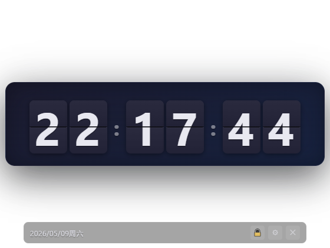
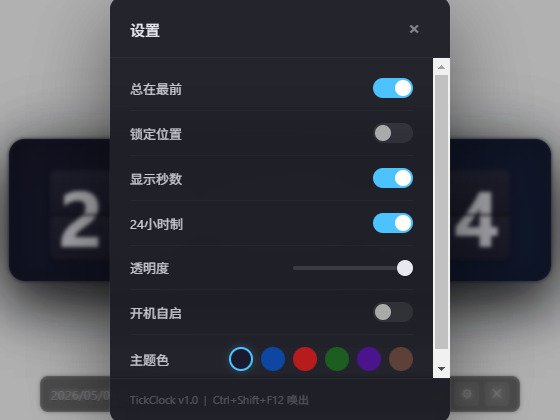
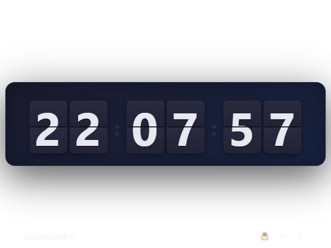
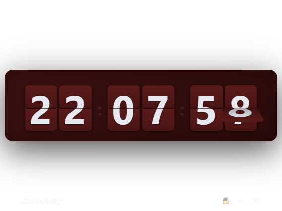
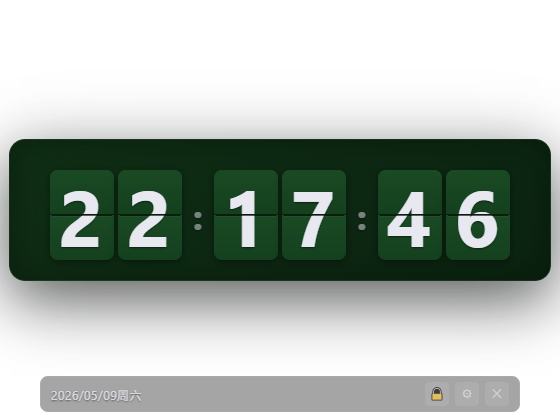
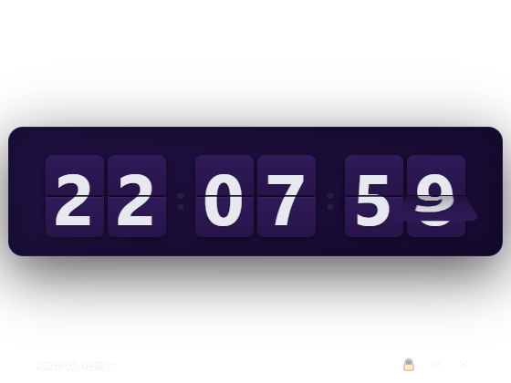
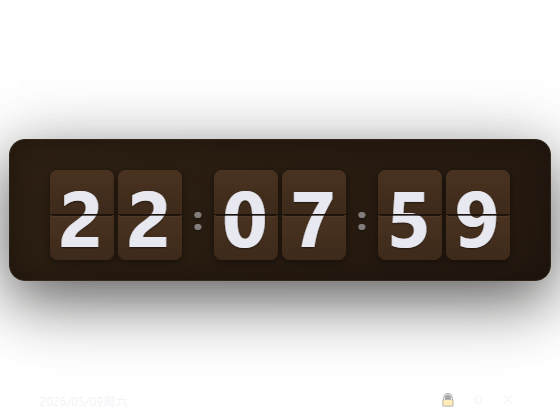
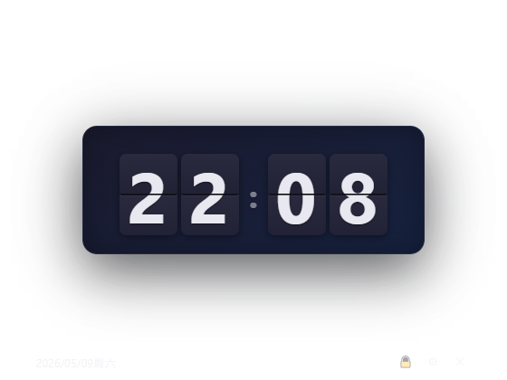

<p align="center">
  
</p>

<h1 align="center">TickClock</h1>

<p align="center">
  <strong>复古翻页钟桌面组件 &middot; 透明 · 无边框 · 毛玻璃</strong><br>
  <sub>Retro Flip Clock Desktop Widget for Windows</sub>
</p>

<p align="center">
  
  
  
</p>

---

## 简介

TickClock 是一个运行在 Windows 桌面的 **翻页时钟小组件**。它使用 CSS 3D 变换模拟复古翻牌时钟的物理翻页效果，窗口全透明无边框，悬浮于桌面之上。

**没有广告，不收集数据，纯本地运行。** 启动后常驻 Windows 系统托盘，右键即可调整设置或退出。所有偏好（主题、位置、透明度、12/24h等）自动记忆，下次启动还原如初。

以下场景你可能会喜欢它：

- 全屏工作时需要一个角落时钟
- 录屏 / 直播时展示时间的桌面小组件
- 喜欢复古翻页钟的视觉风格
- 想要一个不占任务栏的极简定时工具

---

## 功能一览

<table>
<tr><td><b>翻页动画</b></td><td>纯 CSS 3D 翻转，数字变化时触发，视觉还原真实翻牌时钟</td></tr>
<tr><td><b>6 种主题</b></td><td>Dark / Blue / Red / Green / Purple / Wood，设置面板一键切换</td></tr>
<tr><td><b>系统托盘</b></td><td>关闭窗口最小化到托盘，右键菜单控制所有功能，双击快速显隐</td></tr>
<tr><td><b>全局快捷键</b></td><td><code>Ctrl+Shift+F12</code> 随时唤出 / 切换置顶</td></tr>
<tr><td><b>12 / 24 小时制</b></td><td>根据习惯切换，设置持久化记忆</td></tr>
<tr><td><b>秒数开关</b></td><td>关闭秒数即变为简约 HH:MM 时钟</td></tr>
<tr><td><b>透明度</b></td><td>30%~100% 滑块调节，与桌面壁纸完美融合</td></tr>
<tr><td><b>位置记忆</b></td><td>拖动窗口到习惯位置，下次启动自动还原</td></tr>
<tr><td><b>开机自启</b></td><td>托盘菜单或设置面板均可控制</td></tr>
<tr><td><b>锁定拖动</b></td><td>锁定时窗口固定，防止误触位移</td></tr>
</table>

---

## 界面预览

### 主界面 & 设置面板

<p align="center">
  
  
</p>

### 6 种主题

<p align="center">
  
  
  
</p>
<p align="center">
  
  
  
</p>

---

## 安装 & 运行

**前置要求：** [Node.js](https://nodejs.org/) >= 18，Windows 10 / 11

```bash
git clone https://github.com/acangcang-Eliauk/TickClock.git
cd TickClock
npm install
npm start
```

---

## 使用指南

### 鼠标操作

| 操作 | 方式 |
|------|------|
| 拖动窗口 | 按住时钟区域拖动（未锁定时） |
| 打开设置 | 点击 ⚙ 按钮 |
| 锁定 / 解锁 | 点击 🔒 按钮 |
| 隐藏到托盘 | 点击 ✕ 按钮 |
| 全局唤出 | `Ctrl+Shift+F12` |

### 系统托盘

TickClock 启动后自动出现在 Windows 右下角托盘区。

| 操作 | 触发 |
|------|------|
| 右键菜单 | 显示/隐藏 · 设置 · 总在最前 · 开机自启 · 退出 |
| 双击图标 | 快速显示 / 隐藏 |

### 设置面板

所有设置项即时生效并自动保存：

- **总在最前** — 窗口始终悬浮于所有窗口之上
- **锁定位置** — 禁止拖动，防止误触
- **显示秒数** — 关闭后变为 `HH:MM` 极简模式
- **24小时制** — 关闭使用 12h AM/PM
- **透明度** — 30%~100% 滑块
- **开机自启** — 随系统启动
- **主题色** — 6 色可选

---

## 项目结构

```
TickClock/
├── main.js              # 主进程：窗口管理、系统托盘、全局快捷键、IPC
├── preload.js           # 安全的 contextBridge API 暴露
├── tray-icon.png        # 托盘图标
├── src/
│   ├── index.html       # 页面结构
│   ├── css/style.css    # 样式 + 6 主题 + 翻页动画
│   └── js/
│       ├── flip.js      # 翻页卡牌 & 时钟组件
│       ├── clock.js     # 时间逻辑 & 12/24h
│       ├── drag.js      # 拖动 & 锁定
│       └── settings.js  # 设置面板 & 持久化
└── package.json
```

### 动画原理

翻页使用 CSS 3D transform，不依赖任何第三方动画库：

```
上半部分 flip-top:  rotateX(90deg) → 0deg  (0-300ms)
下半部分 flip-bottom: rotateX(90deg) → 0deg  (300-600ms)
perspective: 120px 产生 3D 视差
void offsetHeight 强制回流 → 添加 .flipping 类触发动画
```

---

## License

MIT &copy; 2026 TickClock
